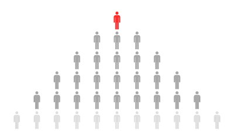
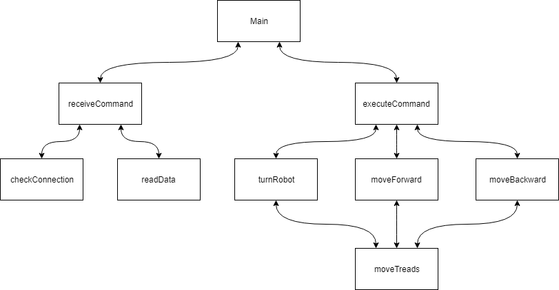

# Functions

Functions give programmers an easy way to organize and break down code. A function simply is a chunk of code that can accept inputs, uses those inputs in some way, and returns an output. You can think of Python functions just like functions in math:


f(x) = x<sup>2</sup> + 3x + 5

	or

y = x<sup>2</sup> + 3x + 5

	
This is a function that requires an x value, performs some calculations on that number (some data), and gives us another number (the y value).

We can make the same setup in Python with even more freedom than math:

```python
def f(x):
	return x*x + 3*x + 5
```
	
(in Python we can’t write 3x because the interpreter gets confused)

While math only lets us use numbers as inputs, Python allows us to use any type of data that we want. We can give a function a list of numbers, a name, GPS coordinates, or all of the book Little Women. We can write a function that does some interesting operations with that data, for example translate its input into Latin or edit the book so that its interesting to read. After it does its assigned operation, it (usually) returns data to its caller.



The best analogy I have to functions is a hired worker. Hired workers are given an assignment to complete, and then after they are done, they return to their boss with their completed work. In an effective company, workers are assigned a position on a hierarchy of roles. There are the grunt workers who just do what they are told, the managers who tell the grunts what to do, and the branch managers who tell the managers what to do, etc, etc. This method works much better than 1000s of workers trying to coordinate with each other or 1 manager managing everyone. The workload is distributed well, so the company does well. 

As programmers, we are CEOs trying to build a company from the top down. We have a big job in our heads that we need to turn into functional code. We have to split that big job into little jobs and then split those little jobs into tiny jobs. 

Each of those jobs are accomplished by functions. Just like how managers tell workers what to do, functions can offload their work on other functions. When a function enlists the help of another function, the process is called **calling**. A function can **call** another function. The “boss” function is the **caller** and the “worker” function is the **called**. 

For example, if you want to write a program to move a tank-like robot wirelessly, you might have a program that looks like this:



This is a flowchart, a graph that shows how each function in our program is connected. The biggest function is the **main** function, which is just the starting point for our program. The main function calls the function `receiveCommand` which is designed to check for any wireless commands that we might have sent to it. `receiveCommand` accomplishes its job by relying on the help of the functions `checkConnection` and `readData`. After `receiveCommand` is finished, the program now knows what command it is supposed to execute. The main function then calls `executeCommand` to actually run this command. Hopefully this gives you a good idea how programs are structured and how functions call other functions. 
